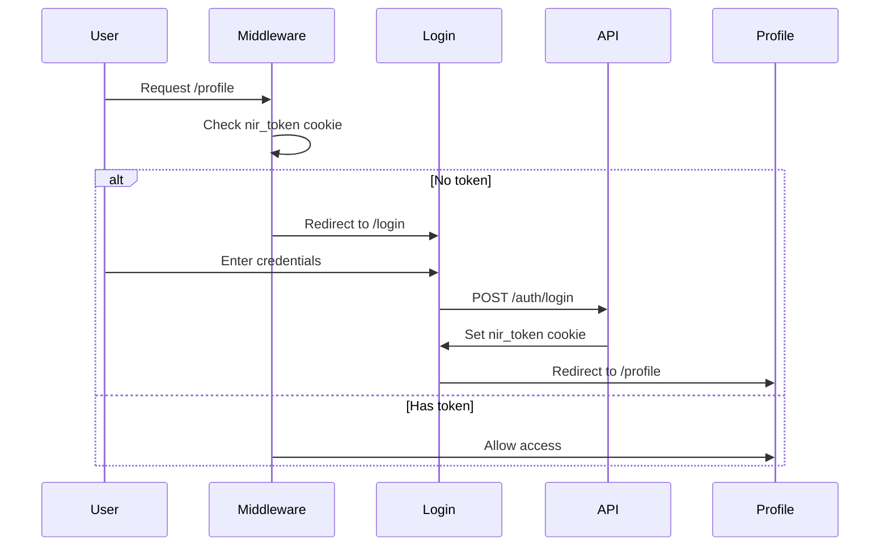

# AI Agent Quick Reference Guide

> **Start Here**: This guide provides everything an AI agent needs to understand and work with the NIR Frontend codebase efficiently.

## 🎯 Project at a Glance

**What is this?** Multi-tenant educational platform (LMS) for students, instructors, and parents.

**Tech Stack**: Next.js 15 (App Router) + TypeScript + Tailwind CSS 4 + shadcn/ui + React Query + Zustand

**Key Feature**: Multi-tenant architecture with subdomain-based routing (`{tenant}.nir-edu.com`)

## 📁 Project Structure (Quick Map)

```
src/
├── app/                      # Next.js App Router
│   ├── (auth)/              # Login, register (no nav)
│   ├── (landing)/           # Public home page
│   ├── (student)/           # Student portal (with nav)
│   │   ├── bundles/         # Courses
│   │   ├── grades/          # Student grades
│   │   ├── profile/         # User profile
│   │   └── store/           # Books store
│   ├── (portal)/            # Parent portal
│   └── api/                 # API routes
├── components/              # React components
│   ├── ui/                  # shadcn/ui components
│   ├── forms/               # Form components
│   ├── modals/              # Modal dialogs
│   └── ...                  # Feature components
├── modules/                 # Feature modules
│   ├── exam/                # Exam logic
│   ├── payment/             # Payment processing
│   └── ...                  # Other modules
├── context/                 # React Context + Zustand stores
├── helpers/                 # Utility functions
│   ├── client-fetch.ts      # Client-side API calls
│   ├── server-fetch.ts      # Server-side API calls
│   └── ...                  # Other helpers
├── services/                # API service layer
├── hooks/                   # Custom React hooks
├── types/                   # TypeScript types
├── lib/                     # Library configs
└── middleware.ts            # Route protection
```

## 🚀 Common Tasks

### 1. Adding a New Page

**Location**: `src/app/(student)/[page-name]/page.tsx`

```typescript
// src/app/(student)/certificates/page.tsx
import { getServerData } from '@/helpers/server-fetch';

export default async function CertificatesPage() {
  // Server-side data fetching
  const data = await getServerData({
    queryKey: ['/certificates'],
    cache: 'no-store' // or 'force-cache' for static
  });

  return (
    <div>
      <h1>الشهادات</h1>
      <CertificatesList data={data?.body} />
    </div>
  );
}
```

**Don't forget**:

1. Add to navigation if needed
2. Add to protected routes in `middleware.ts` if auth required
3. Create loading.tsx for loading state (optional)

### 2. Creating a Component

**Location**: `src/components/[ComponentName].tsx`

```typescript
// src/components/CertificateCard.tsx
import { Card } from '@/components/ui/card';
import { Button } from '@/components/ui/button';
import { cn } from '@/lib/utils';

interface CertificateCardProps {
  certificate: Certificate;
  className?: string;
}

export function CertificateCard({ certificate, className }: CertificateCardProps) {
  return (
    <Card className={cn("p-4", className)}>
      <h3>{certificate.title}</h3>
      <Button>تحميل</Button>
    </Card>
  );
}
```

**Conventions**:

- PascalCase for component names
- Export as named export
- Use `cn()` for className merging
- Accept `className` prop for flexibility

### 3. Fetching Data (Client-Side)

```typescript
"use client";

import { useQuery } from '@tanstack/react-query';
import { getClientPrivateData } from '@/helpers/client-fetch';

export function CoursesClient() {
  const { data, isLoading, error } = useQuery({
    queryKey: ['/courses'],
    queryFn: getClientPrivateData,
    staleTime: 5 * 60 * 1000, // 5 minutes
  });

  if (isLoading) return <LoadingSpinner />;
  if (error) return <ErrorMessage />;

  return <CoursesList courses={data?.body} />;
}
```

### 4. Fetching Data (Server-Side)

```typescript
// Server Component (default in app directory)
import { getServerData } from '@/helpers/server-fetch';

export default async function CoursesPage() {
  const data = await getServerData({
    queryKey: ['/courses'],
    cache: 'no-store' // Dynamic
    // or cache: 'force-cache' // Static
  });

  return <CoursesList courses={data?.body} />;
}
```

### 5. Creating a Form

```typescript
"use client";

import { useForm } from 'react-hook-form';
import { zodResolver } from '@hookform/resolvers/zod';
import { z } from 'zod';
import { Form, FormField, FormItem, FormLabel, FormControl, FormMessage } from '@/components/ui/form';
import { Input } from '@/components/ui/input';
import { Button } from '@/components/ui/button';

const schema = z.object({
  name: z.string().min(2, 'الاسم يجب أن يكون حرفين على الأقل'),
  email: z.string().email('البريد الإلكتروني غير صحيح'),
});

type FormData = z.infer<typeof schema>;

export function MyForm() {
  const form = useForm<FormData>({
    resolver: zodResolver(schema),
    defaultValues: { name: '', email: '' },
  });

  const onSubmit = async (data: FormData) => {
    // Handle submission
  };

  return (
    <Form {...form}>
      <form onSubmit={form.handleSubmit(onSubmit)} className="space-y-4">
        <FormField
          control={form.control}
          name="name"
          render={({ field }) => (
            <FormItem>
              <FormLabel>الاسم</FormLabel>
              <FormControl>
                <Input {...field} />
              </FormControl>
              <FormMessage />
            </FormItem>
          )}
        />
        <Button type="submit">إرسال</Button>
      </form>
    </Form>
  );
}
```

### 6. Adding a Modal

```typescript
"use client";

import { Dialog, DialogContent, DialogHeader, DialogTitle } from '@/components/ui/dialog';
import { Button } from '@/components/ui/button';

export function MyModal({ open, onOpenChange }) {
  return (
    <Dialog open={open} onOpenChange={onOpenChange}>
      <DialogContent>
        <DialogHeader>
          <DialogTitle>عنوان النافذة</DialogTitle>
        </DialogHeader>
        <div>
          {/* Modal content */}
        </div>
        <Button onClick={() => onOpenChange(false)}>إغلاق</Button>
      </DialogContent>
    </Dialog>
  );
}
```

### 7. Using Global State (Zustand)

```typescript
"use client";

import { useBooksStore } from '@/context/BooksStoreProvider';

export function CartButton() {
  // Select only what you need (prevents unnecessary re-renders)
  const totalItems = useBooksStore((state) => state.getTotalItems());
  const addToCart = useBooksStore((state) => state.addToCart);

  return (
    <button onClick={() => addToCart(book)}>
      Add to Cart ({totalItems})
    </button>
  );
}
```

### 8. Protecting a Route

```typescript
// src/middleware.ts
const PROTECTED_ROUTES = new Set([
  "/activities",
  "/grades",
  "/profile",
  "/certificates", // Add your route here
]);
```

### 9. Adding Dynamic Route

```typescript
// src/app/(student)/courses/[courseId]/page.tsx
export default async function CoursePage({
  params
}: {
  params: { courseId: string }
}) {
  const course = await getServerData({
    queryKey: [`/courses/${params.courseId}`]
  });

  return <CourseDetail course={course?.body} />;
}
```

**URL**: `/courses/123` → `params.courseId = "123"`

### 10. Using shadcn/ui Components

```typescript
import { Button } from '@/components/ui/button';
import { Card, CardHeader, CardTitle, CardContent } from '@/components/ui/card';
import { Badge } from '@/components/ui/badge';
import { toast } from '@/hooks/use-toast';

export function Example() {
  return (
    <Card>
      <CardHeader>
        <CardTitle>العنوان</CardTitle>
      </CardHeader>
      <CardContent>
        <Badge>جديد</Badge>
        <Button
          onClick={() => toast({ description: "تم!" })}
        >
          انقر هنا
        </Button>
      </CardContent>
    </Card>
  );
}
```

## 🔑 Key Patterns

### Multi-Tenant Pattern

**Every API request includes tenant information:**

```typescript
// Automatically handled by fetch utilities
headers: {
  'X-Tenant-Domain': host, // e.g., 'math-academy.nir-edu.com'
  'Authorization': `Bearer ${token}`,
}
```

### Server/Client Split

```typescript
// ✅ Server Component (default)
export default async function Page() {
  const data = await getServerData({ queryKey: ['/api'] });
  return <ClientComponent initialData={data} />;
}

// ✅ Client Component (interactive)
"use client";
export function ClientComponent({ initialData }) {
  const [count, setCount] = useState(0);
  return <button onClick={() => setCount(count + 1)}>{count}</button>;
}
```

### Error Handling Pattern

```typescript
try {
  const result = await someAction();
  toast({ description: "تم بنجاح!" });
} catch (error) {
  toast({
    description: error.message || "حدث خطأ",
    variant: "destructive",
  });
}
```

### Loading States

```typescript
const { data, isLoading } = useQuery({ /* ... */ });

if (isLoading) return <LoadingSpinner />;
if (!data) return <Empty message="لا توجد بيانات" />;

return <DataDisplay data={data} />;
```

## 📝 File Naming Conventions

| Type           | Convention           | Example                  |
| -------------- | -------------------- | ------------------------ |
| Components     | PascalCase           | `CourseCard.tsx`         |
| Pages          | lowercase            | `page.tsx`               |
| Utilities      | kebab-case           | `client-fetch.ts`        |
| Types          | PascalCase           | `IUser`, `CourseData`    |
| Hooks          | camelCase with 'use' | `useAuth.ts`             |
| Route groups   | (lowercase)          | `(student)`, `(auth)`    |
| Dynamic routes | [camelCase]          | `[courseId]`, `[examId]` |

## 🎨 Styling Conventions

### Tailwind Classes

```typescript
// Use cn() for conditional classes
import { cn } from '@/lib/utils';

<div className={cn(
  "base-class",
  "another-class",
  isActive && "active-class",
  className // Allow override
)} />
```

### RTL Support

The app is RTL (Right-to-Left) by default for Arabic content:

```typescript
// Tailwind automatically handles RTL
<div className="mr-4"> {/* Becomes margin-left in RTL */}
<div className="text-right"> {/* Becomes text-left in RTL */}
```

## 🔒 Authentication Flow



**Token**: Stored in `nir_token` cookie (HttpOnly)

## 🛠️ Available Tools

### UI Components (shadcn/ui)

All in `src/components/ui/`:

- `button`, `input`, `textarea`, `select`
- `card`, `dialog`, `sheet`, `popover`
- `table`, `tabs`, `accordion`
- `toast`, `alert-dialog`, `dropdown-menu`
- And more...

### Custom Hooks

In `src/hooks/`:

- `use-toast` - Toast notifications
- `useMediaQuery` - Responsive breakpoints
- `useMounted` - Check if component mounted
- `usePayment` - Payment logic
- `useOtp` - OTP verification

### Utilities

In `src/helpers/`:

- `client-fetch.ts` - Client API calls
- `server-fetch.ts` - Server API calls
- `client-error-handler.ts` - Client error handling
- `server-error-handler.ts` - Server error handling

### State Management

- **React Query**: Server state (`useQuery`, `useMutation`)
- **Zustand**: Global client state (cart, preferences)
- **React Context**: Auth, tenant settings
- **React Hook Form**: Form state
- **nuqs**: URL state (filters, pagination)

## ⚠️ Common Pitfalls

### 1. Server/Client Boundary

```typescript
// ❌ Don't use client-only APIs in Server Components
export default async function Page() {
  const data = localStorage.getItem('key'); // Error!
  return <div>{data}</div>;
}

// ✅ Use in Client Components
"use client";
export function ClientPage() {
  const data = localStorage.getItem('key'); // OK
  return <div>{data}</div>;
}
```

### 2. Async Components

```typescript
// ❌ Client Components can't be async
"use client";
export default async function Page() { // Error!
  const data = await fetch('/api');
  return <div>{data}</div>;
}

// ✅ Use useQuery in Client Components
"use client";
export default function Page() {
  const { data } = useQuery({ /* ... */ });
  return <div>{data}</div>;
}
```

### 3. Import Paths

```typescript
// ❌ Don't use relative imports for deep paths
import { Button } from "../../../components/ui/button";

// ✅ Use @ alias
import { Button } from "@/components/ui/button";
```

### 4. TypeScript Errors

The project has `strict: false` and `ignoreBuildErrors: true`, but still try to:

- Add types to function parameters
- Use interfaces for props
- Avoid `any` when possible

## 📚 Quick Links

- **Main README**: [`docs/README.md`](./README.md)
- **Architecture**: [`docs/ARCHITECTURE.md`](./ARCHITECTURE.md)
- **Routing**: [`docs/ROUTING.md`](./ROUTING.md)
- **State Management**: [`docs/STATE-MANAGEMENT.md`](./STATE-MANAGEMENT.md)

## 🎯 Decision Tree

**Need to add a feature? Follow this:**

```
1. Is it a new page?
   → Create in src/app/(student)/[name]/page.tsx
   → Add to middleware if protected

2. Is it a reusable component?
   → Create in src/components/[Name].tsx
   → Use shadcn/ui components as base

3. Is it a form?
   → Use React Hook Form + Zod
   → Create in src/components/forms/

4. Need to fetch data?
   → Server Component: use getServerData()
   → Client Component: use useQuery()

5. Need global state?
   → Server data: React Query
   → Client data: Zustand or Context

6. Need a modal?
   → Use Dialog from shadcn/ui
   → Create in src/components/modals/

7. Need authentication?
   → Use useAuthContext()
   → Check middleware.ts for protection
```

## 💡 Pro Tips

1. **Always check existing components** before creating new ones
2. **Use TypeScript types** from `src/types/index.ts`
3. **Follow the module pattern** for complex features
4. **Test with different tenants** (subdomain routing)
5. **Check mobile responsiveness** (RTL support)
6. **Use React Query DevTools** in development
7. **Leverage Server Components** for better performance
8. **Keep Client Components small** and focused

---

**Remember**: This is a multi-tenant, RTL-first, educational platform. Always consider:

- Tenant isolation
- Arabic language support
- Student/parent/instructor roles
- Mobile-first design
- Performance optimization
