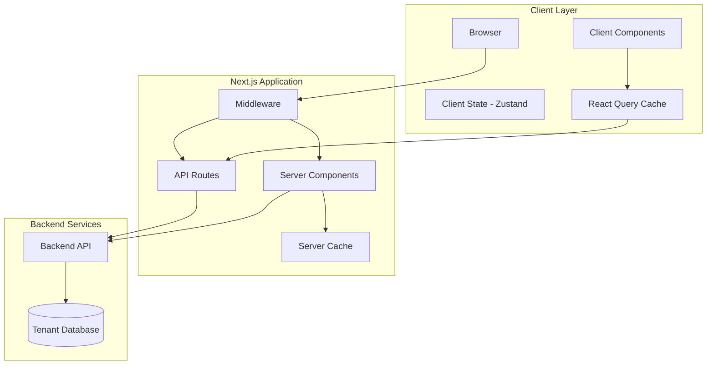
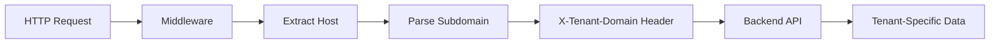
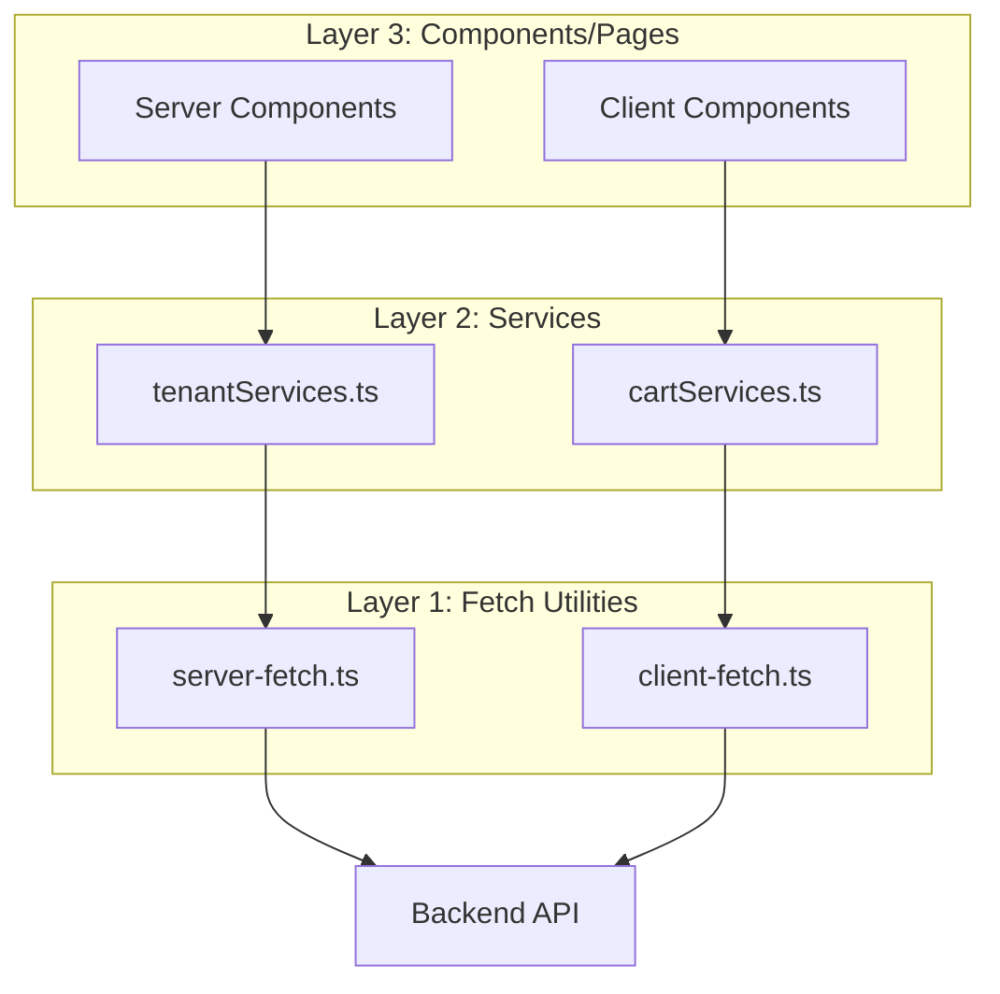
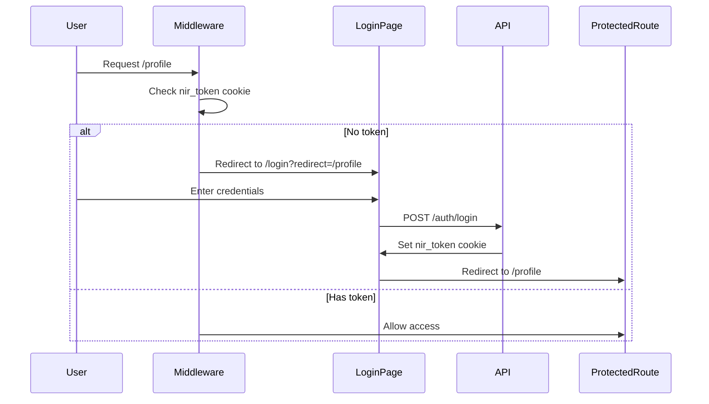
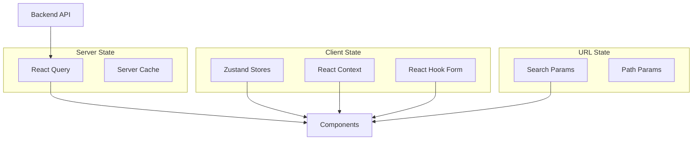

# Architecture Documentation

## 🏗️ System Architecture

### Overview

NIR Frontend follows a **multi-tenant, modular architecture** built on Next.js 15 App Router with a clear separation between client and server concerns.



## 🎯 Core Architectural Patterns

### 1. Multi-Tenant Architecture

The application supports multiple educational institutions through subdomain-based tenant identification.

#### Tenant Resolution Flow



#### Implementation

**Server-side tenant extraction:**

```typescript
// src/helpers/server-utils.ts
export async function extractTenantFromHostServer() {
  const headersList = await headers();
  const host = headersList.get("host") || "";
  const subdomain = host.split(".")[0];
  return { subdomain, host };
}
```

**Client-side tenant extraction:**

```typescript
// src/helpers/fetch-utils.ts
export function extractTenantFromHost() {
  const host = window.location.host;
  const subdomain = host.split(".")[0];
  return { subdomain, host };
}
```

**Tenant settings:**

- Fetched server-side in root layout
- Includes branding (logo, colors, favicon)
- Configures metadata dynamically
- Supports custom domains or subdomain-based routing

### 2. Server/Client Component Strategy

#### Server Components (Default)

- **Pages**: All route pages start as Server Components
- **Data Fetching**: Direct API calls using `getServerData()`
- **Benefits**: SEO, initial load performance, reduced client bundle
- **Use Cases**: Static content, initial data loading, layouts

#### Client Components ("use client")

- **Interactive UI**: Forms, modals, animations
- **State Management**: React Query, Zustand, React Hook Form
- **Browser APIs**: localStorage, cookies, window
- **Use Cases**: User interactions, real-time updates, client state

#### Hybrid Pattern

```typescript
// Server Component (page.tsx)
export default async function CoursePage({ params }) {
  const courseData = await getServerData({
    queryKey: [`/courses/${params.id}`]
  });

  return <CourseClient initialData={courseData} />;
}

// Client Component (CourseClient.tsx)
"use client";
export function CourseClient({ initialData }) {
  const { data } = useQuery({
    queryKey: [`/courses/${initialData.id}`],
    initialData,
    queryFn: getClientPrivateData
  });

  return <InteractiveUI data={data} />;
}
```

### 3. Data Fetching Architecture

#### Three-Layer Approach



#### Server-Side Fetching

**Pattern:**

```typescript
// src/helpers/server-fetch.ts
import "server-only"; // Ensures server-only execution

export async function fetchServer<T>({
  queryKey: [endpoint],
  auth = false,
  cache = "default",
  next,
}: FetchOptions): Promise<T | null> {
  const { subdomain, host } = await extractTenantFromHostServer();
  const token = auth ? (await cookies()).get("nir_token")?.value : null;

  const res = await fetch(buildApiUrl(subdomain, endpoint), {
    headers: {
      "X-Tenant-Domain": host,
      ...(auth ? { Authorization: `Bearer ${token}` } : {}),
    },
    cache,
    next,
  });

  return res.json();
}

// Cached version using React cache
export const getServerData = reactCache(
  async ({ queryKey, next, cache, isAuth = true }) =>
    fetchServer({ queryKey, next, cache, auth: isAuth }),
);
```

**Features:**

- React `cache()` for request deduplication
- Automatic tenant header injection
- Cookie-based authentication
- Error handling with redirects
- Type-safe responses

#### Client-Side Fetching

**Pattern:**

```typescript
// src/helpers/client-fetch.ts
"use client";

export async function fetchClient<T>({
  queryKey: [endpoint],
  auth = false,
  cache = "default",
}: FetchOptions): Promise<T | null> {
  const { subdomain, host } = extractTenantFromHost();
  const token = auth ? Cookies.get("nir_token") : null;

  const res = await fetch(buildApiUrl(subdomain, endpoint), {
    headers: {
      "X-Tenant-Domain": host,
      ...(auth ? { Authorization: `Bearer ${token}` } : {}),
    },
    credentials: "include",
    cache,
  });

  return res.json();
}

// For authenticated requests
export const getClientPrivateData = async ({ queryKey, next, cache }) =>
  fetchClient({ queryKey, next, cache, auth: true });

// For public requests
export const getPublicData = async ({
  queryKey,
  next,
  cache,
  isAuth = false,
}) => fetchClient({ queryKey, next, cache, auth: isAuth });
```

**Integration with React Query:**

```typescript
const { data, isLoading } = useQuery({
  queryKey: ["/api/courses"],
  queryFn: getClientPrivateData,
  staleTime: 5 * 60 * 1000, // 5 minutes
});
```

### 4. Module-Based Organization

The project uses a **feature module pattern** for complex domains:

```
src/modules/
├── exam/              # Exam-related logic
│   ├── hooks/        # useTaskLogic, useExamTimer
│   ├── components/   # Exam-specific components
│   └── utils/        # Exam utilities
├── payment/          # Payment processing
├── video/            # Video player logic
├── books-store/      # Books e-commerce
├── profile/          # User profile
└── parent-portal/    # Parent features
```

**Benefits:**

- Encapsulation of related logic
- Easier testing and maintenance
- Clear boundaries between features
- Reusable across different routes

### 5. Error Handling Strategy

#### Server-Side Error Handling

```typescript
// src/helpers/server-error-handler.ts
export function handleServerFetchError({ error, endpoint, host }) {
  if (error.status === 401) {
    redirect("/login");
  }

  if (error.status === 403) {
    redirect("/unauthorized");
  }

  console.error(`Server fetch error for ${endpoint}:`, error);
  return null; // Graceful degradation
}
```

#### Client-Side Error Handling

```typescript
// src/helpers/client-error-handler.ts
export function handleClientFetchError(error, endpoint) {
  if (error.status === 401) {
    window.location.href = "/login";
  }

  toast({
    title: "خطأ",
    description: error.message || "حدث خطأ أثناء تحميل البيانات",
    variant: "destructive",
  });

  return null;
}
```

#### Error Boundaries

```typescript
// src/app/error.tsx - Route-level error boundary
"use client";

export default function Error({ error, reset }) {
  return (
    <div>
      <h2>حدث خطأ!</h2>
      <button onClick={reset}>حاول مرة أخرى</button>
    </div>
  );
}

// src/app/global-error.tsx - Global error boundary
export default function GlobalError({ error, reset }) {
  return (
    <html>
      <body>
        <h2>حدث خطأ غير متوقع</h2>
        <button onClick={reset}>إعادة تحميل</button>
      </body>
    </html>
  );
}
```

### 6. Authentication Architecture

#### Flow Diagram



#### Implementation Details

**Middleware Protection:**

```typescript
// src/middleware.ts
const PROTECTED_ROUTES = new Set([
  "/activities",
  "/grades",
  "/profile",
  "/store",
  "/payment",
]);

export function middleware(request: NextRequest) {
  const token = request.cookies.get("nir_token")?.value;
  const isProtected = isRouteMatch(pathname, PROTECTED_ROUTES);

  if (isProtected && !token) {
    const loginUrl = request.nextUrl.clone();
    loginUrl.pathname = "/login";
    loginUrl.searchParams.set("redirect", pathname);
    return NextResponse.redirect(loginUrl);
  }

  return NextResponse.next();
}
```

**Token Storage:**

- Cookie name: `nir_token`
- Set by backend API
- HttpOnly for security
- Included in all authenticated requests

### 7. State Management Strategy

#### State Layer Separation



**State Categories:**

1. **Server State** (React Query)
   - API data
   - Cached responses
   - Background refetching

2. **Global Client State** (Zustand)
   - Books cart
   - UI preferences
   - Temporary data

3. **Component State** (React Context)
   - Auth context
   - Tenant settings
   - Modal state

4. **Form State** (React Hook Form)
   - Form inputs
   - Validation state
   - Submission state

5. **URL State** (nuqs)
   - Filters
   - Pagination
   - Search queries

## 🔧 Configuration Architecture

### Environment-Based Configuration

```typescript
// next.config.mjs
const nextConfig = {
  typescript: {
    ignoreBuildErrors: true, // Flexible for mixed TS/JS
  },
  images: {
    remotePatterns: [
      { hostname: "*.nir-edu.com" },
      { hostname: "cdn03.vdocipher.com" },
    ],
  },
};
```

### Path Aliases

```json
// tsconfig.json
{
  "compilerOptions": {
    "paths": {
      "@/*": ["./src/*"]
    }
  }
}
```

**Usage:**

```typescript
import { Button } from "@/components/ui/button";
import { getServerData } from "@/helpers/server-fetch";
import { IUser } from "@/types";
```

## 📦 Build & Deployment Architecture

### Build Process

1. **Type Checking**: Skipped (ignoreBuildErrors: true)
2. **Linting**: Skipped (ignoreDuringBuilds: true)
3. **Static Generation**: Pages without dynamic data
4. **Server Components**: Pre-rendered on server
5. **Client Bundles**: Code-split by route

### Deployment Considerations

- **Multi-tenant routing**: Requires wildcard subdomain support
- **Environment variables**: Tenant-specific configuration
- **CDN**: Static assets served from `/public`
- **API proxy**: Backend API calls proxied through Next.js

## 🎨 Styling Architecture

### Tailwind CSS Configuration

- **Version**: 4.1.17 (latest)
- **Custom utilities**: Extended font sizes, custom colors
- **RTL Support**: Built-in for Arabic content
- **Dark mode**: Class-based (optional)

### Component Styling Pattern

```typescript
import { cn } from '@/lib/utils';

export function Component({ className, ...props }) {
  return (
    <div
      className={cn(
        "base-styles",
        "responsive-styles",
        className // Allow override
      )}
      {...props}
    />
  );
}
```

## 🔐 Security Architecture

### Security Measures

1. **Authentication**: Cookie-based with HttpOnly flag
2. **Authorization**: Middleware-level route protection
3. **CSRF Protection**: Credentials: "include" for cookies
4. **XSS Prevention**: React's built-in escaping
5. **Tenant Isolation**: Header-based tenant identification

### Best Practices

- Never expose tokens in client-side code
- Validate all user inputs with Zod schemas
- Use server actions for mutations when possible
- Sanitize user-generated content
- Implement rate limiting on API routes

## 📊 Performance Architecture

### Optimization Strategies

1. **Code Splitting**: Automatic by Next.js
2. **Image Optimization**: Next.js Image component
3. **Font Optimization**: next/font with Almarai
4. **Caching**: React Query + Server cache
5. **Lazy Loading**: Dynamic imports for heavy components

### Performance Patterns

```typescript
// Lazy load heavy components
const VideoPlayer = dynamic(() => import('@/components/VideoPlayer'), {
  loading: () => <Skeleton />,
  ssr: false,
});

// Optimize images
import Image from 'next/image';

<Image
  src={course.image}
  alt={course.title}
  width={400}
  height={300}
  loading="lazy"
/>
```

---

**Key Takeaways:**

- Multi-tenant architecture with subdomain routing
- Clear separation between server and client concerns
- Three-layer data fetching (utilities → services → components)
- Module-based organization for complex features
- Comprehensive error handling at all levels
- Type-safe API integration with TypeScript
