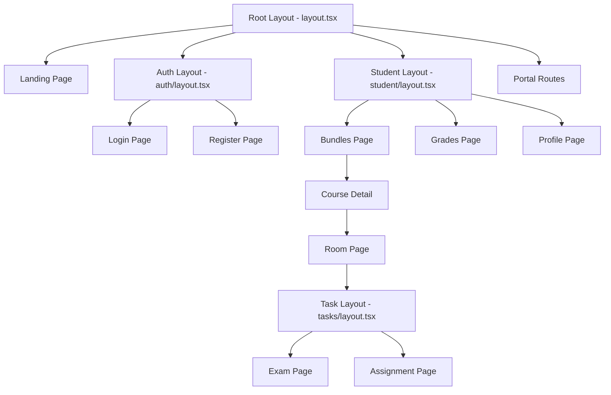

# Routing Documentation

## 📍 Next.js App Router Structure

This project uses **Next.js 15 App Router** with a sophisticated routing structure that includes route groups, dynamic segments, and parallel routes.

## 🗂️ Route Organization

### Directory Structure

```
src/app/
├── (auth)/                    # Authentication routes (layout group)
│   ├── layout.tsx            # Auth-specific layout
│   ├── login/
│   │   └── page.tsx          # /login
│   ├── register/
│   │   └── page.tsx          # /register
│   ├── forgetPassword/
│   │   └── page.tsx          # /forgetPassword
│   └── resetPassword/
│       └── page.jsx          # /resetPassword
│
├── (landing)/                 # Public landing page (layout group)
│   ├── page.tsx              # / (home)
│   └── loading.tsx           # Loading state
│
├── (student)/                 # Student portal (layout group)
│   ├── layout.tsx            # Student-specific layout with nav
│   ├── activities/
│   │   └── page.jsx          # /activities
│   ├── bundles/
│   │   ├── page.tsx          # /bundles (course list)
│   │   ├── showBundle/
│   │   │   └── page.tsx      # /bundles/showBundle
│   │   └── [SingleCourse]/   # Dynamic route
│   │       ├── page.tsx      # /bundles/:courseId
│   │       ├── (courseExam)/ # Route group for course exams
│   │       │   ├── layout.tsx
│   │       │   └── general-exams/
│   │       │       └── [examId]/
│   │       │           └── page.tsx  # /bundles/:courseId/general-exams/:examId
│   │       └── [room]/       # Nested dynamic route
│   │           ├── page.tsx  # /bundles/:courseId/:roomId
│   │           └── (tasks)/  # Route group for tasks
│   │               ├── layout.tsx
│   │               ├── exams/
│   │               │   └── [examId]/
│   │               │       └── page.tsx  # /bundles/:courseId/:roomId/exams/:examId
│   │               ├── assignments/
│   │               │   └── [assignmentId]/
│   │               │       └── page.tsx
│   │               └── tasks/
│   │                   └── [taskId]/
│   │                       └── page.tsx
│   ├── grades/
│   │   └── page.tsx          # /grades
│   ├── profile/
│   │   ├── page.tsx          # /profile
│   │   ├── accountSettings/
│   │   │   └── page.tsx      # /profile/accountSettings
│   │   └── comments/
│   │       └── page.tsx      # /profile/comments
│   ├── store/
│   │   └── page.tsx          # /store
│   ├── orders/
│   │   └── page.tsx          # /orders
│   ├── payment/
│   │   └── page.tsx          # /payment
│   ├── privacy/
│   │   └── page.tsx          # /privacy
│   └── terms/
│       └── page.tsx          # /terms
│
├── (portal)/                  # Portal routes (layout group)
│   ├── parent-portal/
│   │   └── page.tsx          # /parent-portal
│   └── short/
│       └── [shortToken]/
│           ├── page.tsx      # /short/:token
│           └── RedirectToPortal.tsx
│
├── api/                       # API routes
│   └── delete-session/
│       └── route.ts          # POST /api/delete-session
│
├── layout.tsx                 # Root layout
├── loading.tsx                # Global loading
├── error.tsx                  # Global error boundary
├── global-error.tsx           # Global error fallback
├── not-found.tsx              # 404 page
└── providers.tsx              # Client providers wrapper
```

## 🎯 Route Groups Explained

### What are Route Groups?

Route groups use parentheses `(groupName)` to organize routes **without affecting the URL structure**.

### Benefits

1. **Logical Organization**: Group related routes together
2. **Shared Layouts**: Apply layouts to specific route groups
3. **Clean URLs**: Parentheses don't appear in the URL
4. **Multiple Layouts**: Different layouts for different sections

### Examples in This Project

#### 1. Authentication Group `(auth)`

```
src/app/(auth)/
├── layout.tsx          # Auth-specific layout (no nav, centered form)
├── login/page.tsx      # URL: /login
├── register/page.tsx   # URL: /register
└── forgetPassword/page.tsx  # URL: /forgetPassword
```

**Purpose**: Shared layout for authentication pages without navigation.

#### 2. Student Portal Group `(student)`

```
src/app/(student)/
├── layout.tsx          # Student layout (with navigation, sidebar)
├── bundles/page.tsx    # URL: /bundles
├── grades/page.tsx     # URL: /grades
└── profile/page.tsx    # URL: /profile
```

**Purpose**: Shared layout with student navigation and authentication.

#### 3. Tasks Group `(tasks)`

```
src/app/(student)/bundles/[SingleCourse]/[room]/(tasks)/
├── layout.tsx          # Task-specific layout
├── exams/[examId]/page.tsx
├── assignments/[assignmentId]/page.tsx
└── tasks/[taskId]/page.tsx
```

**Purpose**: Shared layout for all task types (exams, assignments, tasks).

## 🔀 Dynamic Routes

### Single Dynamic Segment

**Pattern**: `[paramName]`

```typescript
// src/app/(student)/bundles/[SingleCourse]/page.tsx
export default async function CoursePage({
  params,
}: {
  params: { SingleCourse: string };
}) {
  const courseId = params.SingleCourse;
  // Fetch course data
}
```

**URL Examples**:

- `/bundles/123` → `params.SingleCourse = "123"`
- `/bundles/math-101` → `params.SingleCourse = "math-101"`

### Nested Dynamic Segments

**Pattern**: `[param1]/[param2]`

```typescript
// src/app/(student)/bundles/[SingleCourse]/[room]/page.tsx
export default async function RoomPage({
  params,
}: {
  params: { SingleCourse: string; room: string };
}) {
  const courseId = params.SingleCourse;
  const roomId = params.room;
  // Fetch room data
}
```

**URL Examples**:

- `/bundles/123/456` → `{ SingleCourse: "123", room: "456" }`
- `/bundles/math/lesson-1` → `{ SingleCourse: "math", room: "lesson-1" }`

### Triple Nested Dynamic Segments

```typescript
// src/app/(student)/bundles/[SingleCourse]/[room]/(tasks)/exams/[examId]/page.tsx
export default async function ExamPage({
  params,
}: {
  params: {
    SingleCourse: string;
    room: string;
    examId: string;
  };
}) {
  const { SingleCourse, room, examId } = params;
  // Fetch exam data
}
```

**URL**: `/bundles/123/456/exams/789`

## 🛣️ Route Patterns

### 1. List → Detail Pattern

```
/bundles              # List all courses
/bundles/[id]         # Single course detail
/bundles/[id]/[room]  # Room within course
```

### 2. Nested Resource Pattern

```
/bundles/[courseId]/[roomId]/exams/[examId]
```

**Hierarchy**: Course → Room → Exam

### 3. Settings/Profile Pattern

```
/profile                    # Main profile
/profile/accountSettings    # Settings page
/profile/comments           # Comments page
```

## 📄 Special Files

### layout.tsx

Defines UI shared across multiple pages.

```typescript
// src/app/(student)/layout.tsx
export default function StudentLayout({ children }) {
  return (
    <div>
      <StudentNavbar />
      <main>{children}</main>
      <Footer />
    </div>
  );
}
```

**Key Points**:

- Wraps all child pages
- Persists across navigation
- Can be nested
- Receives `children` prop

### page.tsx

Defines the unique UI for a route.

```typescript
// src/app/(student)/grades/page.tsx
export default async function GradesPage() {
  const grades = await getServerData({ queryKey: ['/grades'] });
  return <GradesTable data={grades} />;
}
```

**Key Points**:

- Required to make route publicly accessible
- Can be Server or Client Component
- Receives `params` and `searchParams` props

### loading.tsx

Automatic loading UI with Suspense.

```typescript
// src/app/(landing)/loading.tsx
export default function Loading() {
  return <Skeleton />;
}
```

**Key Points**:

- Wraps page in `<Suspense>`
- Shows while page is loading
- Can be at any level

### error.tsx

Error boundary for route segment.

```typescript
// src/app/error.tsx
"use client"; // Must be Client Component

export default function Error({ error, reset }) {
  return (
    <div>
      <h2>حدث خطأ!</h2>
      <button onClick={reset}>حاول مرة أخرى</button>
    </div>
  );
}
```

**Key Points**:

- Must be Client Component
- Catches errors in child segments
- Provides `reset()` function

### not-found.tsx

Custom 404 page.

```typescript
// src/app/not-found.tsx
export default function NotFound() {
  return <h2>الصفحة غير موجودة</h2>;
}
```

## 🔒 Protected Routes

### Middleware-Based Protection

```typescript
// src/middleware.ts
const PROTECTED_ROUTES = new Set([
  "/activities",
  "/grades",
  "/profile",
  "/store",
  "/payment",
]);

export function middleware(request: NextRequest) {
  const pathname = request.nextUrl.pathname;
  const token = request.cookies.get("nir_token")?.value;

  if (isRouteMatch(pathname, PROTECTED_ROUTES) && !token) {
    return NextResponse.redirect(new URL("/login", request.url));
  }

  return NextResponse.next();
}
```

**Protected Routes**:

- `/activities`
- `/grades`
- `/profile`
- `/store`
- `/payment`
- All `/bundles/[id]/[room]/*` routes (implicitly)

**Public Routes**:

- `/` (landing)
- `/login`
- `/register`
- `/forgetPassword`
- `/resetPassword`

## 🔗 Navigation Patterns

### Link Component

```typescript
import Link from 'next/link';

<Link href="/bundles">عرض الدورات</Link>
<Link href={`/bundles/${courseId}`}>تفاصيل الدورة</Link>
<Link href={`/bundles/${courseId}/${roomId}/exams/${examId}`}>
  بدء الامتحان
</Link>
```

### Programmatic Navigation

```typescript
"use client";
import { useRouter } from "next/navigation";

export function Component() {
  const router = useRouter();

  const handleClick = () => {
    router.push("/bundles");
    // or
    router.replace("/login"); // No history entry
    // or
    router.back(); // Go back
  };
}
```

### With Search Params

```typescript
// Using nuqs for URL state
import { useQueryState } from 'nuqs';

const [filter, setFilter] = useQueryState('filter');

// URL: /bundles?filter=active
<button onClick={() => setFilter('active')}>
  تصفية
</button>
```

## 🎨 Layout Hierarchy



## 📝 Adding New Routes

### Example: Adding a "Certificates" Page

1. **Create the page file**:

```typescript
// src/app/(student)/certificates/page.tsx
export default async function CertificatesPage() {
  const certificates = await getServerData({
    queryKey: ['/certificates']
  });

  return (
    <div>
      <h1>شهاداتي</h1>
      <CertificatesList data={certificates} />
    </div>
  );
}
```

2. **Add to navigation** (if needed):

```typescript
// src/components/includes/NavbarWrapper.tsx
const navItems = [
  { href: "/bundles", label: "الدورات" },
  { href: "/grades", label: "الدرجات" },
  { href: "/certificates", label: "الشهادات" }, // New
];
```

3. **Add to protected routes** (if needed):

```typescript
// src/middleware.ts
const PROTECTED_ROUTES = new Set([
  "/activities",
  "/grades",
  "/profile",
  "/certificates", // New
]);
```

### Example: Adding a Dynamic Route

```typescript
// src/app/(student)/certificates/[certificateId]/page.tsx
export default async function CertificateDetailPage({
  params
}: {
  params: { certificateId: string }
}) {
  const certificate = await getServerData({
    queryKey: [`/certificates/${params.certificateId}`]
  });

  return <CertificateDetail data={certificate} />;
}
```

**URL**: `/certificates/123`

## 🔍 Route Conventions

### File Naming

- **Pages**: `page.tsx` or `page.jsx`
- **Layouts**: `layout.tsx`
- **Loading**: `loading.tsx`
- **Error**: `error.tsx`
- **Not Found**: `not-found.tsx`

### Folder Naming

- **Route groups**: `(groupName)` - lowercase, descriptive
- **Dynamic segments**: `[paramName]` - camelCase or kebab-case
- **Regular routes**: `kebab-case` - lowercase with hyphens

### Component Naming

- **Page components**: Match the route purpose (e.g., `GradesPage`)
- **Layout components**: `[Group]Layout` (e.g., `StudentLayout`)

## 🚀 Performance Considerations

### Static vs Dynamic Routes

**Static** (pre-rendered at build time):

- `/` (landing page)
- `/login`
- `/register`
- `/privacy`
- `/terms`

**Dynamic** (rendered on-demand):

- `/bundles/[id]`
- `/bundles/[id]/[room]`
- `/grades`
- `/profile`

### Loading Strategies

```typescript
// Streaming with Suspense
import { Suspense } from 'react';

export default function Page() {
  return (
    <div>
      <Suspense fallback={<Skeleton />}>
        <SlowComponent />
      </Suspense>
      <FastComponent />
    </div>
  );
}
```

## 📊 Route Analytics

### Common Routes by User Type

**Guest Users**:

- `/` - Landing page
- `/login` - Authentication
- `/register` - Sign up

**Authenticated Students**:

- `/bundles` - Browse courses
- `/bundles/[id]` - Course details
- `/bundles/[id]/[room]` - Lesson content
- `/bundles/[id]/[room]/exams/[examId]` - Take exam
- `/grades` - View grades
- `/profile` - Manage profile

**Parents**:

- `/parent-portal` - Monitor student progress

---

**Key Takeaways**:

- Route groups organize without affecting URLs
- Dynamic segments enable flexible routing
- Middleware protects sensitive routes
- Layouts provide shared UI across route segments
- Special files (loading, error, not-found) enhance UX
