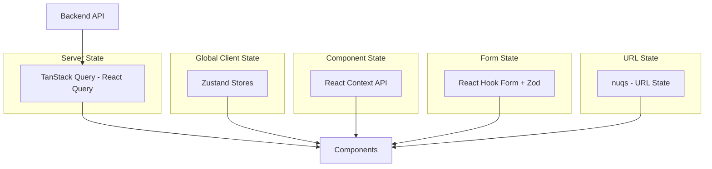
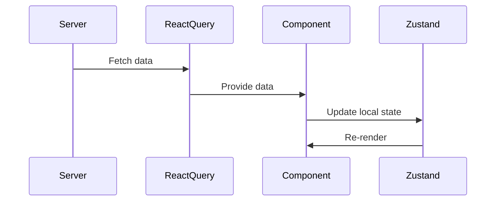
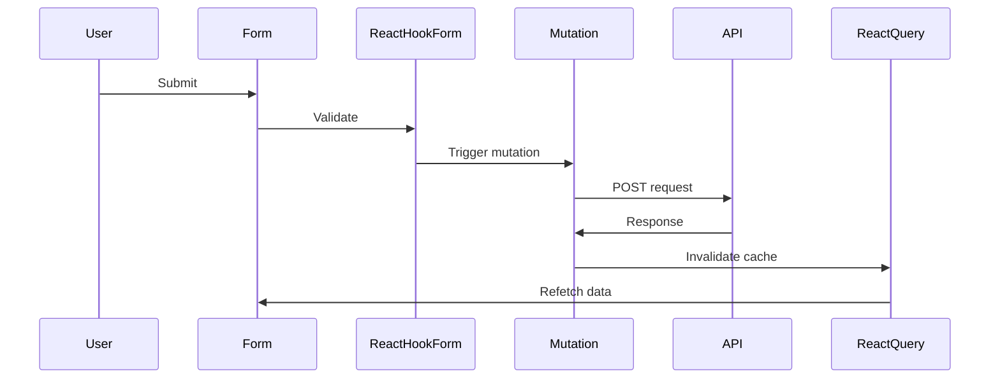

# State Management Documentation

## 🎯 State Management Strategy

The project uses a **multi-layered state management approach**, with different tools for different types of state:



## 📊 State Categories

### 1. Server State (React Query)

**Purpose**: Manage data from the backend API

**Library**: TanStack Query (React Query) v5.x

**Use Cases**:

- Fetching user data
- Course listings
- Exam questions
- Grades
- Any data from the backend

#### Configuration

```typescript
// src/layouts/QueryProvider.tsx
import { QueryClient, QueryClientProvider } from '@tanstack/react-query';

const queryClient = new QueryClient({
  defaultOptions: {
    queries: {
      staleTime: 5 * 60 * 1000, // 5 minutes
      gcTime: 10 * 60 * 1000,   // 10 minutes (formerly cacheTime)
      retry: 1,
      refetchOnWindowFocus: false,
    },
  },
});

export function QueryProvider({ children }) {
  return (
    <QueryClientProvider client={queryClient}>
      {children}
      <ReactQueryDevtools initialIsOpen={false} />
    </QueryClientProvider>
  );
}
```

#### Usage Patterns

**Basic Query:**

```typescript
import { useQuery } from '@tanstack/react-query';
import { getClientPrivateData } from '@/helpers/client-fetch';

export function CoursesPage() {
  const { data, isLoading, error, refetch } = useQuery({
    queryKey: ['/courses'],
    queryFn: getClientPrivateData,
    staleTime: 5 * 60 * 1000,
  });

  if (isLoading) return <LoadingSpinner />;
  if (error) return <ErrorMessage />;

  return <CoursesList courses={data?.body} />;
}
```

**Query with Parameters:**

```typescript
const { data } = useQuery({
  queryKey: [`/courses/${courseId}`],
  queryFn: getClientPrivateData,
  enabled: !!courseId, // Only run if courseId exists
});
```

**Mutation (POST/PUT/DELETE):**

```typescript
import { useMutation, useQueryClient } from '@tanstack/react-query';

export function useSubmitExam() {
  const queryClient = useQueryClient();

  return useMutation({
    mutationFn: async (examData) => {
      const response = await fetch('/api/exams/submit', {
        method: 'POST',
        body: JSON.stringify(examData),
      });
      return response.json();
    },
    onSuccess: () => {
      // Invalidate and refetch
      queryClient.invalidateQueries({ queryKey: ['/exams'] });
    },
    onError: (error) => {
      toast({
        title: "خطأ",
        description: error.message,
        variant: "destructive",
      });
    },
  });
}

// Usage
function ExamForm() {
  const submitExam = useSubmitExam();

  const handleSubmit = (data) => {
    submitExam.mutate(data);
  };

  return (
    <form onSubmit={handleSubmit}>
      {/* form fields */}
      <button disabled={submitExam.isPending}>
        {submitExam.isPending ? 'جاري الإرسال...' : 'إرسال'}
      </button>
    </form>
  );
}
```

**Optimistic Updates:**

```typescript
const mutation = useMutation({
  mutationFn: updateCourse,
  onMutate: async (newCourse) => {
    // Cancel outgoing refetches
    await queryClient.cancelQueries({ queryKey: ["/courses"] });

    // Snapshot previous value
    const previousCourses = queryClient.getQueryData(["/courses"]);

    // Optimistically update
    queryClient.setQueryData(["/courses"], (old) => [...old, newCourse]);

    // Return context with snapshot
    return { previousCourses };
  },
  onError: (err, newCourse, context) => {
    // Rollback on error
    queryClient.setQueryData(["/courses"], context.previousCourses);
  },
  onSettled: () => {
    // Refetch after error or success
    queryClient.invalidateQueries({ queryKey: ["/courses"] });
  },
});
```

**Prefetching:**

```typescript
const queryClient = useQueryClient();

// Prefetch on hover
const handleMouseEnter = () => {
  queryClient.prefetchQuery({
    queryKey: [`/courses/${courseId}`],
    queryFn: getClientPrivateData,
  });
};
```

### 2. Global Client State (Zustand)

**Purpose**: Manage client-side global state

**Library**: Zustand v5.x

**Use Cases**:

- Shopping cart
- UI preferences
- Temporary data that needs to persist across components

#### Example: Books Cart Store

```typescript
// src/context/booksCartStore.ts
import { createStore } from "zustand/vanilla";
import { persist, createJSONStorage } from "zustand/middleware";
import { immer } from "zustand/middleware/immer";

export interface CartState {
  items: CartItem[];
  isLoading: boolean;
  cartId: number | null;

  // Actions
  addToCart: (book: Book) => Promise<void>;
  removeFromCart: (id: string) => Promise<void>;
  incrementQuantity: (id: string) => Promise<void>;
  decrementQuantity: (id: string) => Promise<void>;
  clearCart: () => Promise<void>;

  // Getters
  getTotalPrice: () => number;
  getTotalItems: () => number;
}

export const createCartStore = (initState?: Partial<CartState>) => {
  return createStore<CartState>()(
    persist(
      immer((set, get) => ({
        items: initState?.items || [],
        cartId: null,
        isLoading: false,

        addToCart: async (book) => {
          // Optimistic update
          set((state) => {
            const existingItem = state.items.find(
              (item) => item.id === book.id,
            );
            if (existingItem) {
              existingItem.quantity += 1;
            } else {
              state.items.push({ ...book, quantity: 1 });
            }
          });

          try {
            await cartServices.addItem(book);
          } catch (error) {
            // Rollback on error
            set((state) => {
              const existingItem = state.items.find(
                (item) => item.id === book.id,
              );
              if (existingItem && existingItem.quantity > 1) {
                existingItem.quantity -= 1;
              } else {
                state.items = state.items.filter((item) => item.id !== book.id);
              }
            });
            toast({ description: "حدث خطأ" });
          }
        },

        getTotalPrice: () =>
          get().items.reduce(
            (total, item) => total + item.price * item.quantity,
            0,
          ),

        getTotalItems: () =>
          get().items.reduce((total, item) => total + item.quantity, 0),
      })),
      {
        name: "cart-storage",
        storage: createJSONStorage(() => localStorage),
        partialize: (state) => ({ items: state.items }),
      },
    ),
  );
};
```

#### Provider Pattern

```typescript
// src/context/BooksStoreProvider.tsx
"use client";

import { createContext, useContext, useRef } from 'react';
import { useStore } from 'zustand';
import { createCartStore, CartState } from './booksCartStore';

const BooksStoreContext = createContext<ReturnType<typeof createCartStore> | null>(null);

export function BooksStoreProvider({ children, ...props }) {
  const storeRef = useRef<ReturnType<typeof createCartStore>>();

  if (!storeRef.current) {
    storeRef.current = createCartStore(props);
  }

  return (
    <BooksStoreContext.Provider value={storeRef.current}>
      {children}
    </BooksStoreContext.Provider>
  );
}

export function useBooksStore<T>(selector: (state: CartState) => T): T {
  const store = useContext(BooksStoreContext);
  if (!store) throw new Error('Missing BooksStoreProvider');
  return useStore(store, selector);
}
```

#### Usage in Components

```typescript
"use client";

import { useBooksStore } from '@/context/BooksStoreProvider';

export function CartButton() {
  const totalItems = useBooksStore((state) => state.getTotalItems());
  const addToCart = useBooksStore((state) => state.addToCart);

  return (
    <button onClick={() => addToCart(book)}>
      Add to Cart ({totalItems})
    </button>
  );
}
```

**Key Features**:

- **Immer middleware**: Immutable updates with mutable syntax
- **Persist middleware**: Auto-save to localStorage
- **Optimistic updates**: Instant UI feedback with rollback on error
- **Selector-based**: Only re-render when selected state changes

### 3. Component State (React Context)

**Purpose**: Share state across component tree without prop drilling

**Use Cases**:

- Authentication state
- Tenant settings
- Modal state
- Theme preferences

#### Example: Auth Context

```typescript
// src/context/auth-context.tsx
"use client";

import { createContext, useContext, useState, useCallback } from 'react';
import { useQuery } from '@tanstack/react-query';
import { getClientPrivateData } from '@/helpers/client-fetch';
import Cookies from 'js-cookie';

interface AuthContextType {
  token: string | null;
  profile: IUser | null;
  isLoading: boolean;
  logout: () => Promise<void>;
  setToken: (token: string) => void;
}

const AuthContext = createContext<AuthContextType>(null);

export const useAuthContext = () => {
  const context = useContext(AuthContext);
  if (!context) {
    throw new Error('useAuthContext must be used within AuthContextProvider');
  }
  return context;
};

export function AuthContextProvider({ children }) {
  const [token, setToken] = useState<string | null>(
    () => Cookies.get('nir_token') || null
  );

  const { data: profileData, isLoading } = useQuery({
    queryKey: ['/students/profile'],
    queryFn: getClientPrivateData,
    enabled: !!token,
    staleTime: 20 * 60 * 1000, // 20 minutes
  });

  const logout = useCallback(async () => {
    setToken(null);
    Cookies.remove('nir_token');
    Cookies.remove('guest_token');
    localStorage.removeItem('timer');
    await deleteCookie('nir_token');
  }, []);

  return (
    <AuthContext.Provider
      value={{
        token,
        setToken,
        profile: profileData?.body || null,
        isLoading,
        logout,
      }}
    >
      {children}
    </AuthContext.Provider>
  );
}
```

#### Usage

```typescript
import { useAuthContext } from '@/context/auth-context';

export function ProfilePage() {
  const { profile, isLoading, logout } = useAuthContext();

  if (isLoading) return <LoadingSpinner />;

  return (
    <div>
      <h1>مرحباً {profile?.first_name}</h1>
      <button onClick={logout}>تسجيل الخروج</button>
    </div>
  );
}
```

#### Example: Tenant Context

```typescript
// src/context/TenantProvider.tsx
"use client";

import { createContext, useContext } from 'react';

const TenantContext = createContext<TenantSettings | null>(null);

export function TenantProvider({ children, settings }) {
  return (
    <TenantContext.Provider value={settings}>
      {children}
    </TenantContext.Provider>
  );
}

export function useTenant() {
  const context = useContext(TenantContext);
  if (!context) {
    throw new Error('useTenant must be used within TenantProvider');
  }
  return context;
}
```

### 4. Form State (React Hook Form + Zod)

**Purpose**: Manage form inputs, validation, and submission

**Libraries**:

- React Hook Form v7.x
- Zod v3.x
- @hookform/resolvers

**Use Cases**:

- Login/Register forms
- Exam submissions
- Profile updates
- Payment forms

#### Pattern

```typescript
import { useForm } from 'react-hook-form';
import { zodResolver } from '@hookform/resolvers/zod';
import { z } from 'zod';

// Define schema
const loginSchema = z.object({
  phone: z.string().min(10, 'رقم الهاتف غير صحيح'),
  password: z.string().min(6, 'كلمة المرور يجب أن تكون 6 أحرف على الأقل'),
});

type LoginFormData = z.infer<typeof loginSchema>;

export function LoginForm() {
  const form = useForm<LoginFormData>({
    resolver: zodResolver(loginSchema),
    defaultValues: {
      phone: '',
      password: '',
    },
  });

  const onSubmit = async (data: LoginFormData) => {
    try {
      const response = await fetch('/api/auth/login', {
        method: 'POST',
        body: JSON.stringify(data),
      });
      // Handle success
    } catch (error) {
      form.setError('root', {
        message: 'فشل تسجيل الدخول',
      });
    }
  };

  return (
    <form onSubmit={form.handleSubmit(onSubmit)}>
      <input
        {...form.register('phone')}
        placeholder="رقم الهاتف"
      />
      {form.formState.errors.phone && (
        <span>{form.formState.errors.phone.message}</span>
      )}

      <input
        {...form.register('password')}
        type="password"
        placeholder="كلمة المرور"
      />
      {form.formState.errors.password && (
        <span>{form.formState.errors.password.message}</span>
      )}

      <button type="submit" disabled={form.formState.isSubmitting}>
        {form.formState.isSubmitting ? 'جاري التحميل...' : 'تسجيل الدخول'}
      </button>
    </form>
  );
}
```

#### With shadcn/ui Form Components

```typescript
import { Form, FormControl, FormField, FormItem, FormLabel, FormMessage } from '@/components/ui/form';
import { Input } from '@/components/ui/input';
import { Button } from '@/components/ui/button';

export function LoginForm() {
  const form = useForm<LoginFormData>({
    resolver: zodResolver(loginSchema),
  });

  return (
    <Form {...form}>
      <form onSubmit={form.handleSubmit(onSubmit)} className="space-y-4">
        <FormField
          control={form.control}
          name="phone"
          render={({ field }) => (
            <FormItem>
              <FormLabel>رقم الهاتف</FormLabel>
              <FormControl>
                <Input {...field} placeholder="01xxxxxxxxx" />
              </FormControl>
              <FormMessage />
            </FormItem>
          )}
        />

        <FormField
          control={form.control}
          name="password"
          render={({ field }) => (
            <FormItem>
              <FormLabel>كلمة المرور</FormLabel>
              <FormControl>
                <Input {...field} type="password" />
              </FormControl>
              <FormMessage />
            </FormItem>
          )}
        />

        <Button type="submit" disabled={form.formState.isSubmitting}>
          تسجيل الدخول
        </Button>
      </form>
    </Form>
  );
}
```

### 5. URL State (nuqs)

**Purpose**: Manage state in URL search parameters

**Library**: nuqs v2.x

**Use Cases**:

- Filters
- Pagination
- Search queries
- Sorting

#### Usage

```typescript
import { useQueryState, parseAsInteger, parseAsString } from 'nuqs';

export function CoursesPage() {
  const [page, setPage] = useQueryState('page', parseAsInteger.withDefault(1));
  const [search, setSearch] = useQueryState('search', parseAsString.withDefault(''));
  const [filter, setFilter] = useQueryState('filter');

  // URL: /courses?page=2&search=math&filter=active

  return (
    <div>
      <input
        value={search}
        onChange={(e) => setSearch(e.target.value)}
        placeholder="بحث..."
      />

      <select value={filter || ''} onChange={(e) => setFilter(e.target.value)}>
        <option value="">الكل</option>
        <option value="active">نشط</option>
        <option value="completed">مكتمل</option>
      </select>

      <Pagination
        currentPage={page}
        onPageChange={setPage}
      />
    </div>
  );
}
```

**Benefits**:

- Shareable URLs
- Browser back/forward support
- SSR-friendly
- Type-safe parsers

## 🔄 State Flow Patterns

### Server → Client State Flow



### Form Submission Flow



## 🎯 Best Practices

### 1. Choose the Right Tool

| State Type            | Tool            | Example                       |
| --------------------- | --------------- | ----------------------------- |
| Server data           | React Query     | User profile, courses, grades |
| Global client state   | Zustand         | Shopping cart, UI preferences |
| Component tree state  | React Context   | Auth, tenant settings         |
| Form state            | React Hook Form | Login, registration, exams    |
| URL state             | nuqs            | Filters, pagination, search   |
| Local component state | useState        | Toggle, input value           |

### 2. Avoid Prop Drilling

**Bad:**

```typescript
<Parent data={data}>
  <Child data={data}>
    <GrandChild data={data}>
      <GreatGrandChild data={data} />
    </GrandChild>
  </Child>
</Parent>
```

**Good:**

```typescript
// Use Context or React Query
<Parent>
  <Child>
    <GrandChild>
      <GreatGrandChild /> {/* Uses useQuery or useContext */}
    </GrandChild>
  </Child>
</Parent>
```

### 3. Optimize Re-renders

**Zustand with selectors:**

```typescript
// Only re-render when totalItems changes
const totalItems = useBooksStore((state) => state.getTotalItems());

// Not this (re-renders on any state change)
const store = useBooksStore();
const totalItems = store.getTotalItems();
```

**React Query with select:**

```typescript
const { data: courseName } = useQuery({
  queryKey: [`/courses/${id}`],
  queryFn: getClientPrivateData,
  select: (data) => data.body.name, // Only re-render when name changes
});
```

### 4. Handle Loading and Error States

```typescript
const { data, isLoading, error } = useQuery({
  queryKey: ['/courses'],
  queryFn: getClientPrivateData,
});

if (isLoading) return <LoadingSpinner />;
if (error) return <ErrorMessage error={error} />;
if (!data) return <Empty message="لا توجد دورات" />;

return <CoursesList courses={data.body} />;
```

### 5. Implement Optimistic Updates

For better UX, update UI immediately and rollback on error:

```typescript
const mutation = useMutation({
  mutationFn: updateCourse,
  onMutate: async (newData) => {
    // Optimistic update
    queryClient.setQueryData(["/courses"], (old) => ({
      ...old,
      ...newData,
    }));
  },
  onError: (err, newData, context) => {
    // Rollback
    queryClient.setQueryData(["/courses"], context.previousData);
  },
});
```

---

**Key Takeaways**:

- Use React Query for server state
- Use Zustand for global client state
- Use React Context for component tree state
- Use React Hook Form + Zod for forms
- Use nuqs for URL state
- Choose the right tool for the job
- Optimize re-renders with selectors
- Handle loading and error states
- Implement optimistic updates for better UX
